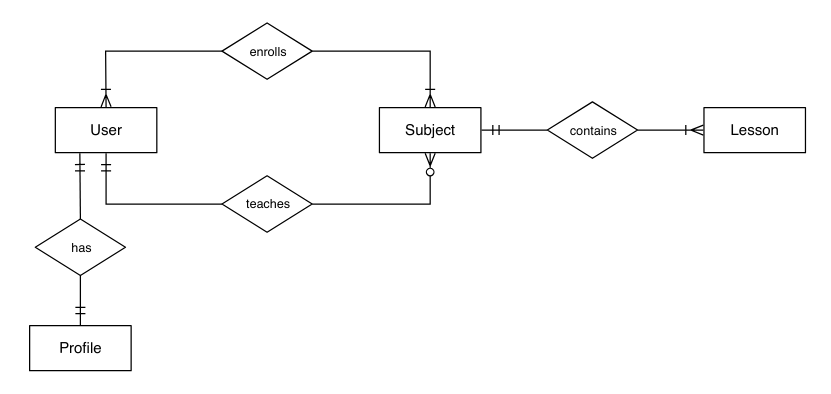

**Diseño del Sistema**

### Arquitectura del sistema

El sistema está diseñado como una aplicación web utilizando el framework Django. La arquitectura del sistema incluye los siguientes componentes:

- Base de datos: se utiliza una base de datos relacional para almacenar los datos de los usuarios y cursos.
- Servidor web: se utiliza un servidor web para manejar las solicitudes y respuestas de los usuarios.
- Aplicación web: se utiliza una aplicación web para proporcionar la interfaz de usuario y la logica de negocio.

### Modelo de datos

El modelo de datos incluye las siguientes entidades:

- Usuarios: profesores y estudiantes.
- Cursos: cursos en línea.
- Evaluaciones: evaluaciones de estudiantes por parte de profesores.
- Foros: foros de discusión entre profesores y estudiantes.

### Diagramas

A continuación un diagrama entidad-relación (E-R) de los modelos:

### **Entidades**

1. **User**:  
   Representa a los usuarios del sistema. Estos pueden ser estudiantes, profesores o cualquier persona que interactúe con la plataforma.

   - Está relacionado con las entidades `Profile` y `Subject`.
   - Su cardinalidad con `Profile` indica que cada usuario tiene un único perfil, y cada perfil pertenece a un solo usuario.

2. **Profile**:  
   Representa información adicional del usuario, como detalles personales, preferencias o configuraciones.

   - Está relacionado únicamente con la entidad `User` a través de la relación `has`.

3. **Subject**:  
   Representa materias, cursos o temas que se pueden estudiar o enseñar.

   - Está relacionado con `User` mediante las relaciones `enrolls` (matrícula) y `teaches` (enseñanza).
   - Además, está relacionado con `Lesson`.

4. **Lesson**:  
   Representa lecciones específicas que forman parte de una materia (`Subject`).
   - Está relacionada únicamente con la entidad `Subject` a través de la relación `contains` (contiene).

---

### **Relaciones**

1. **has (User ↔ Profile)**:  
   Indica que cada usuario tiene un perfil único. La relación es de cardinalidad uno a uno (1:1).

2. **enrolls (User ↔ Subject)**:  
   Representa la inscripción de un usuario en una materia.

   - La cardinalidad muestra que un usuario puede inscribirse en múltiples materias, y cada materia puede tener múltiples usuarios inscritos.
   - Es una relación muchos a muchos (N:M).

3. **teaches (User ↔ Subject)**:  
   Indica que un usuario (probablemente un profesor) puede enseñar varias materias, y cada materia puede ser enseñada por varios usuarios.

   - Es una relación muchos a muchos (N:M).

4. **contains (Subject ↔ Lesson)**:  
   Representa la composición de una materia por lecciones.
   - La cardinalidad muestra que una materia contiene múltiples lecciones, pero cada lección pertenece a una sola materia.
   - Es una relación uno a muchos (1:N).

---

### Resumen general del diagrama

Este diagrama describe un sistema educativo donde:

- Los usuarios tienen perfiles únicos.
- Los usuarios pueden matricularse en materias y también pueden enseñarlas.
- Las materias están compuestas por lecciones, y cada lección está asociada a una única materia.

---

### Decisiones de diseño

- Se utiliza el framework Django para proporcionar una estructura y herramientas para el desarrollo de la aplicación.
- Se utiliza una base de datos relacional para almacenar los datos de los usuarios y cursos.
- Se utiliza un servidor web para manejar las solicitudes y respuestas de los usuarios.
